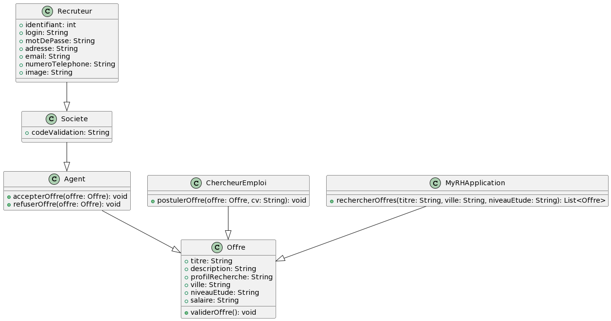
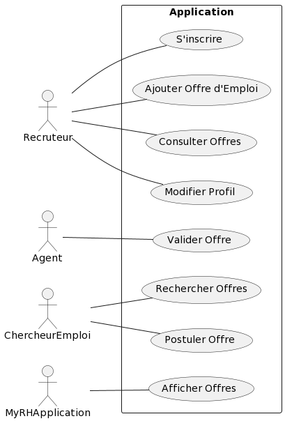

# Projet MyRH Web Application

## Description du Projet

Dans le cadre de son développement, le cabinet MyRH souhaite simplifier la recherche d'emploi pour les Marocains. Cette application web sera utilisée par les recruteurs et les chercheurs d'emploi. Elle permettra aux sociétés de publier des offres d'emploi et aux chercheurs d'emploi de postuler.

## Diagramme de Classes

Le diagramme de classes UML représente la structure des entités dans le système.

## Diagramme de Cas d'Utilisation

Le diagramme de cas d'utilisation UML décrit les interactions entre les acteurs et le système.

## Endpoints

### Recruiter Controller

#### Create Recruiter
- **Endpoint**: `POST /api/v1/recruiter`
- **Description**: Create a new recruiter.
- **Request Body**: [RecruiterRequest](#recruiterrequest)
- **Response**: [RecruiterRequest](#recruiterrequest)

#### Get All Recruiters
- **Endpoint**: `GET /api/v1/recruiter`
- **Description**: Retrieve a list of all recruiters.
- **Response**: List of [RecruiterResponse](#recruiterresponse)

#### Get Recruiter by ID
- **Endpoint**: `GET /api/v1/recruiter/{id}`
- **Description**: Retrieve a recruiter by their ID.
- **Path Variable**: `id` - Recruiter ID
- **Response**: [RecruiterResponse](#recruiterresponse)

#### Delete Recruiter
- **Endpoint**: `DELETE /api/v1/recruiter/{id}`
- **Description**: Delete a recruiter by their ID.
- **Path Variable**: `id` - Recruiter ID
- **Response**: Success message

### Job Offer Controller

#### Create Job Offer
- **Endpoint**: `POST /api/v1/offers`
- **Description**: Create a new job offer.
- **Request Body**: [JobOffreRequest](#joboffrerequest)
- **Response**: [JobOffreRequest](#joboffrerequest)

#### Get All Job Offers
- **Endpoint**: `GET /api/v1/offers`
- **Description**: Retrieve a list of all job offers.
- **Response**: List of [JobOffreResponse](#joboffreresponse)

#### Get Job Offer by ID
- **Endpoint**: `GET /api/v1/offers/{id}`
- **Description**: Retrieve a job offer by its ID.
- **Path Variable**: `id` - Job Offer ID
- **Response**: [JobOffreResponse](#joboffreresponse)

#### Delete Job Offer
- **Endpoint**: `DELETE /api/v1/offers/{id}`
- **Description**: Delete a job offer by its ID.
- **Path Variable**: `id` - Job Offer ID
- **Response**: Success message

### Company Controller

#### Create Company
- **Endpoint**: `POST /api/v1/company`
- **Description**: Create a new company.
- **Request Body**: [CompanyRequest](#companyrequest)
- **Response**: [CompanyRequest](#companyrequest)

#### Get All Companies
- **Endpoint**: `GET /api/v1/company`
- **Description**: Retrieve a list of all companies.
- **Response**: List of [CompanyResponse](#companyresponse)

#### Get Company by ID
- **Endpoint**: `GET /api/v1/company/{id}`
- **Description**: Retrieve a company by its ID.
- **Path Variable**: `id` - Company ID
- **Response**: [CompanyResponse](#companyresponse)

#### Delete Company
- **Endpoint**: `DELETE /api/v1/company/{id}`
- **Description**: Delete a company by its ID.
- **Path Variable**: `id` - Company ID
- **Response**: Success message

### Application Controller

#### Create Application
- **Endpoint**: `POST /api/v1/application`
- **Description**: Create a new application.
- **Request Body**: [ApplicationRequest](#applicationrequest)
- **Response**: [ApplicationRequest](#applicationrequest)

#### Get All Companies
- **Endpoint**: `GET /api/v1/application`
- **Description**: Retrieve a list of all application.
- **Response**: List of [ApplicationResponse](#applicationresponse)

#### Get Application by ID
- **Endpoint**: `GET /api/v1/application/{id}`
- **Description**: Retrieve a application by its ID.
- **Path Variable**: `id` - Application ID
- **Response**: [ApllicationResponse](#applicationresponse)

#### Delete Application
- **Endpoint**: `DELETE /api/v1/application/{id}`
- **Description**: Delete a Application by its ID.
- **Path Variable**: `id` - Application ID
- **Response**: Success message

### Agent Controller

#### Create Agent
- **Endpoint**: `POST /api/v1/agent`
- **Description**: Create a new Agent.
- **Request Body**: [AgentRequest](#agentrequest)
- **Response**: [AgentRequest](#agentrequest)

#### Get All Agent
- **Endpoint**: `GET /api/v1/agent`
- **Description**: Retrieve a list of all Agents.
- **Response**: List of [AgentResponse](#agentresponse)

#### Get Agent by ID
- **Endpoint**: `GET /api/v1/agent/{id}`
- **Description**: Retrieve a agent by its ID.
- **Path Variable**: `id` - Agent ID
- **Response**: [AgentResponse](#agentresponse)

#### Delete Agent
- **Endpoint**: `DELETE /api/v1/agent/{id}`
- **Description**: Delete a agent by its ID.
- **Path Variable**: `id` - Agent ID
- **Response**: Success message
